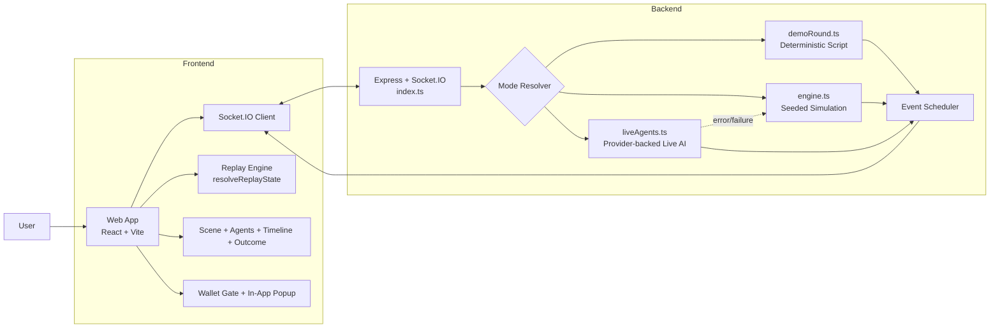
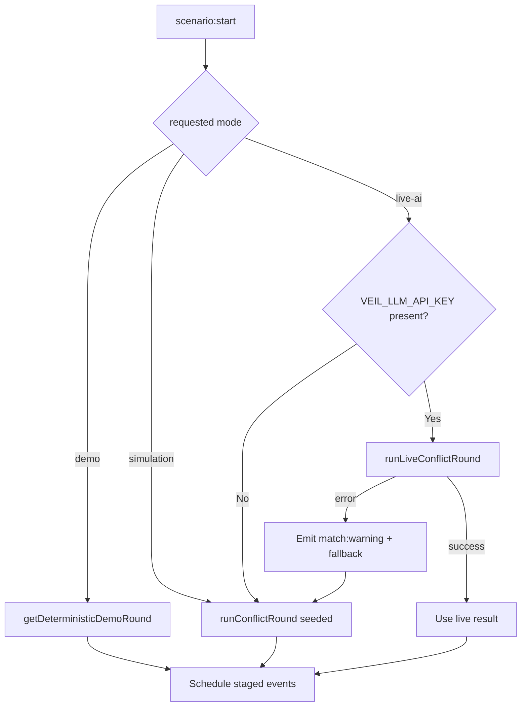
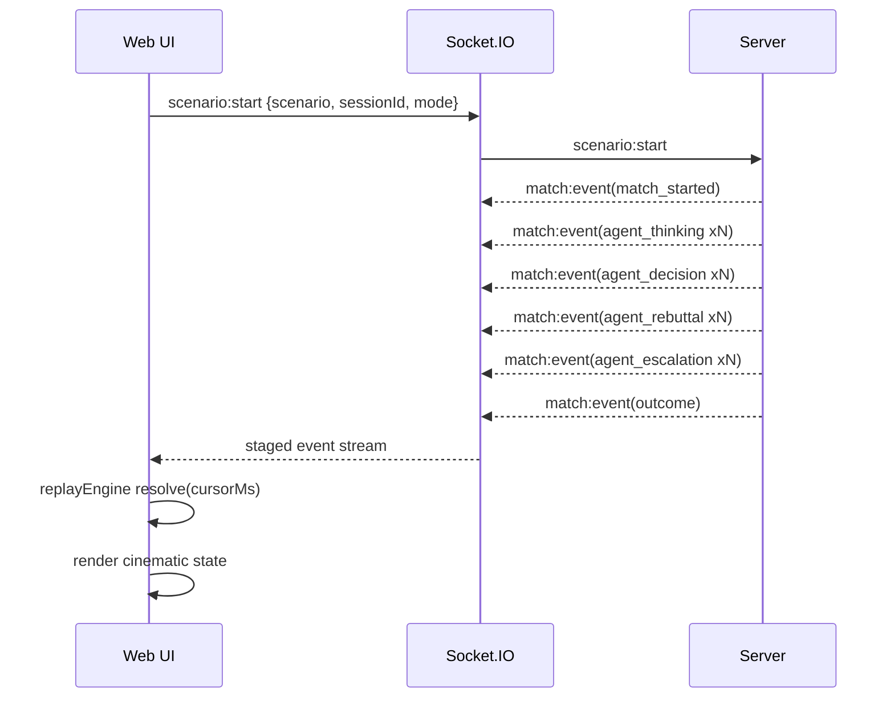
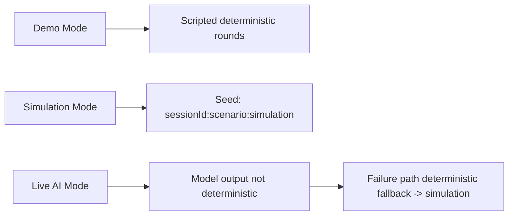

# VEIL Architecture (Diagram-First)

This is the schematic view of VEIL: how a user action becomes staged conflict events, replay state, and cinematic UI.

## 1) System Map



## 2) Runtime Mode Decision



## 3) Event Timeline Contract



Primary `match:event` order:

1. `match_started`
2. `agent_thinking`
3. `agent_decision`
4. `agent_rebuttal`
5. `agent_escalation`
6. `outcome`

Auxiliary channels:

- `match:warning` (fallback/degradation)
- `match:error` (validation input errors)

## 4) Frontend Replay Pipeline

```mermaid
flowchart LR
  E[Raw events[]] --> C[Cursor ms]
  C --> R[resolveReplayState]
  E --> R
  R --> RS[ReplayState\nsession/mode/turns/rebuttals/escalations/outcome]
  RS --> V1[Live Scene]
  RS --> V2[Agent Chamber]
  RS --> V3[Timeline Scrubber]
  RS --> V4[Outcome Layer]
  RS --> V5[Narration Overlay]
```

Why this matters:

- Render state is **derived**, not imperative.
- Scrubbing is deterministic and reversible.
- No server mutation required for replay.

## 5) Wallet Gate (Interaction Guard)

```mermaid
flowchart TD
  BTN[Button click] --> G{wallet connected?}
  G -->|Yes| RUN[Execute action]
  G -->|No| BLOCK[Block action]
  BLOCK --> POP[Open in-app modal\n"Please connect your wallet first."]
  POP --> CW[CONNECT WALLET]
  CW --> OK{connected?}
  OK -->|Yes| CLOSE[Close modal]
  OK -->|No| STAY[Keep guarded state]
```

Guarded operations include:

- start scenario (`INITIATE VEIL`)
- replay export
- share action

LIVE AI extra guard:

- `live-ai` mode additionally requires a verified BNB Chain off-chain message signature
- server flow: `POST /auth/challenge` -> wallet signature -> `POST /auth/verify` -> short-lived `liveAuthToken`
- missing/expired token degrades to `simulation` with `match:warning`

Ungated demo operations:

- `WATCH A VEIL` / `WATCH NEXT VEIL`
- watch picks

## 6) Determinism Strategy



Presentation lock in UI:

- `WATCH A VEIL` is locked to: `Should I ape into this new meme coin?`

This stabilizes judge demos around the manipulator-exposure narrative.

## 7) Backend Components by Responsibility

- `apps/server/src/index.ts`
  - HTTP + Socket entry
  - mode resolution
  - staged emission scheduler
- `apps/server/src/demoRound.ts`
  - predefined deterministic demo rounds
- `apps/server/src/engine.ts`
  - simulation turn generation
  - consensus/risk/outcome scoring
- `apps/server/src/liveAgents.ts`
  - provider calls
  - schema validation (`zod`)
  - retries + timeout + circuit breaker
- `apps/server/src/types.ts`
  - canonical backend contracts

## 8) Frontend Components by Responsibility

- `apps/web/src/App.tsx`
  - socket lifecycle
  - interaction orchestration
  - wallet gate + popup
  - camera/audio/event-driven UI
- `apps/web/src/replayEngine.ts`
  - deterministic replay-state derivation
- `apps/web/src/narration.ts`
  - event-to-narration mapping
- `apps/web/src/types.ts`
  - frontend event contracts

## 9) API + Config Surface

### API

- `GET /health`
  - `ok`, `service`, live-ai readiness flags, `llmProviderHint`
- `GET /agents`
  - static agent metadata

### Env

Frontend:

- `VITE_VEIL_SERVER`
- `VITE_WALLETCONNECT_PROJECT_ID`

Server:

- `VEIL_LLM_API_KEY`
- `VEIL_LLM_MODEL`
- `VEIL_LLM_BASE_URL`
- `VEIL_LLM_TIMEOUT_MS`
- `VEIL_LLM_MAX_RETRIES`
- `VEIL_LLM_BREAKER_COOLDOWN_MS`

## 10) Reliability Notes

- Missing live credentials => simulation fallback path.
- Live provider runtime errors => warning + simulation degradation.
- Replay export includes timestamp sanity guard.
- Bundle-size warnings are performance signals, not functional blockers.

## 11) Security Notes

- Never commit real provider keys.
- Live mode trusts external provider responses but enforces strict schema parsing.
- Wallet is used for contextual gating in this app; no on-chain execution path is included.

---

If code changes, keep this file synced first with:

- `apps/server/src/index.ts`
- `apps/server/src/types.ts`
- `apps/web/src/App.tsx`